# Bank Account Management System

### Java Programming Mini Project · REVA University

<p align="center">
  <strong>R24SA003 · Aman Chaturvedi</strong><br>
  B.Sc. (BSTCs) · Semester V · Java Programming
</p>

<p align="center">
  A console-based banking application demonstrating Java object-oriented programming, account operations, transaction handling, and system reporting.
</p>

---

## Project Overview

The **Bank Account Management System** is a menu-driven Java application that models customers, savings accounts, current accounts, and financial transactions. It demonstrates object-oriented programming (OOP), modular package organization, input handling, and formatted console output through a practical banking scenario.

The project is organized into four custom packages: `app`, `model`, `service`, and `util`.

## Features

| Feature | Description |
|---|---|
| Customer registration | Registers a customer with basic details. |
| Account creation | Opens savings or current accounts for registered customers. |
| Account listing | Displays account type, customer, account number, and balance. |
| Deposits and withdrawals | Performs balance operations and reports the resulting balance. |
| Money transfer | Transfers money between two accounts. |
| Transaction history | Lists recorded transaction IDs, types, amounts, and timestamps. |
| Interest and service charges | Calculates the applicable savings-account interest or current-account service charge. |
| System statistics | Summarizes customers, accounts, total balance, and a payable calculation example. |
| Input handling | Uses console input utilities and validation. |

## Application Screenshots

The screenshots below show the application running in the Java console. Each pair is arranged side-by-side to make the feature walkthrough easier to scan. All screenshots use a consistent 16:9 canvas and the same scaling treatment so every gallery tile has the same dimensions. The original console output is preserved without cropping or stretching.

<table>
  <tr>
    <td width="50%" valign="top">
      <h3>01 · Main Menu</h3>
      <p>The main menu gives the user access to each banking operation.</p>
      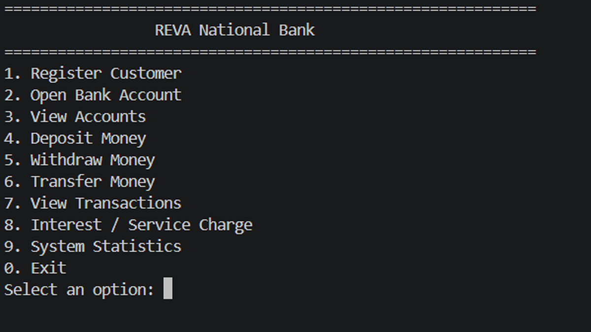
    </td>
    <td width="50%" valign="top">
      <h3>02 · Customer Registration</h3>
      <p>Collects customer details and confirms successful registration.</p>
      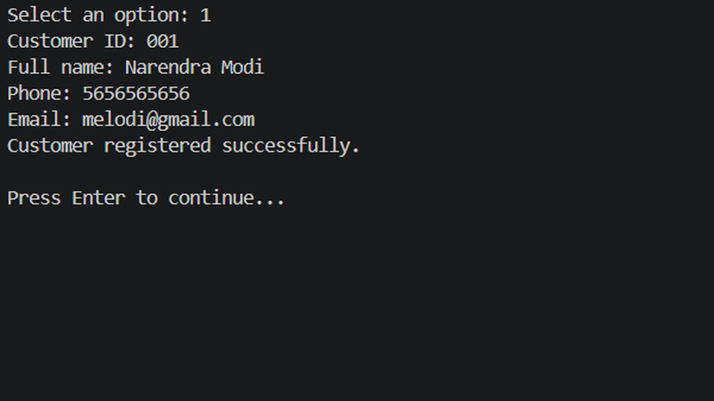
    </td>
  </tr>
  <tr>
    <td width="50%" valign="top">
      <h3>03 · Account Opening</h3>
      <p>Links an account to a registered customer and selects the account type.</p>
      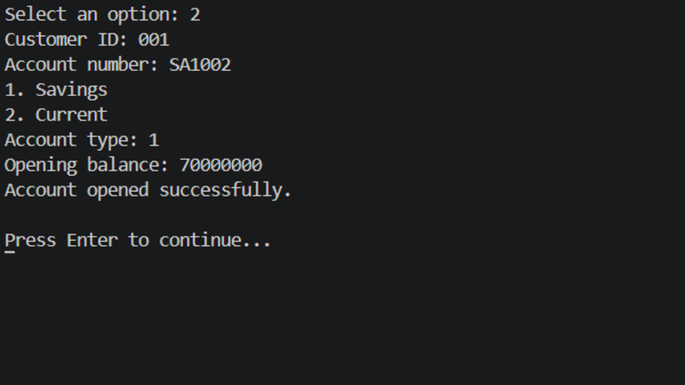
    </td>
    <td width="50%" valign="top">
      <h3>04 · Account Listing</h3>
      <p>Displays the available accounts with their types, owners, and balances.</p>
      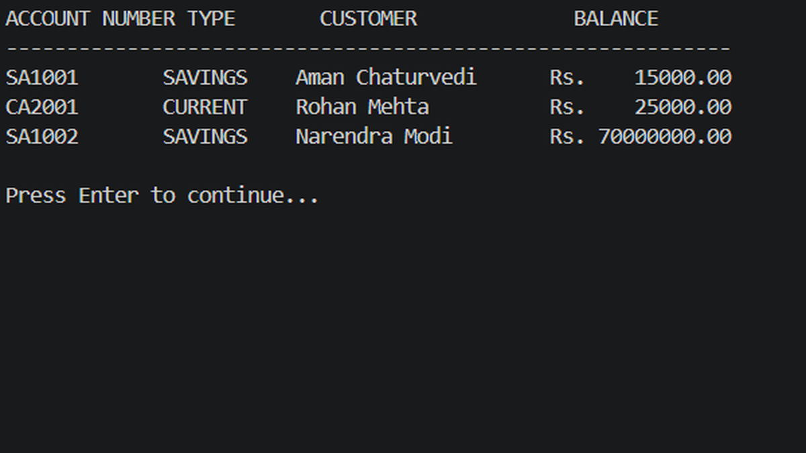
    </td>
  </tr>
  <tr>
    <td width="50%" valign="top">
      <h3>05 · Deposit Money</h3>
      <p>Records a deposit and displays the updated account balance.</p>
      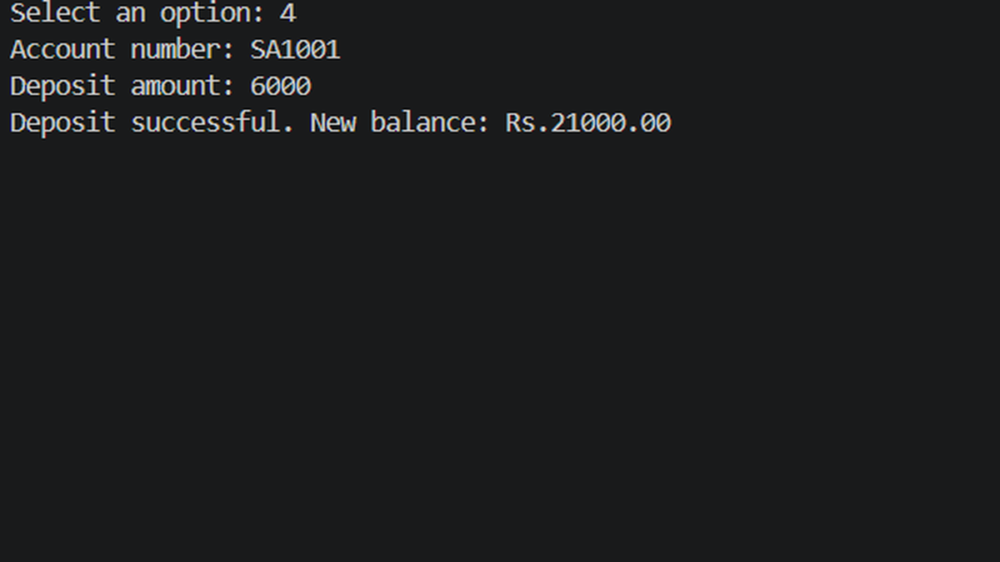
    </td>
    <td width="50%" valign="top">
      <h3>06 · Withdraw Money</h3>
      <p>Processes a withdrawal and confirms the remaining balance.</p>
      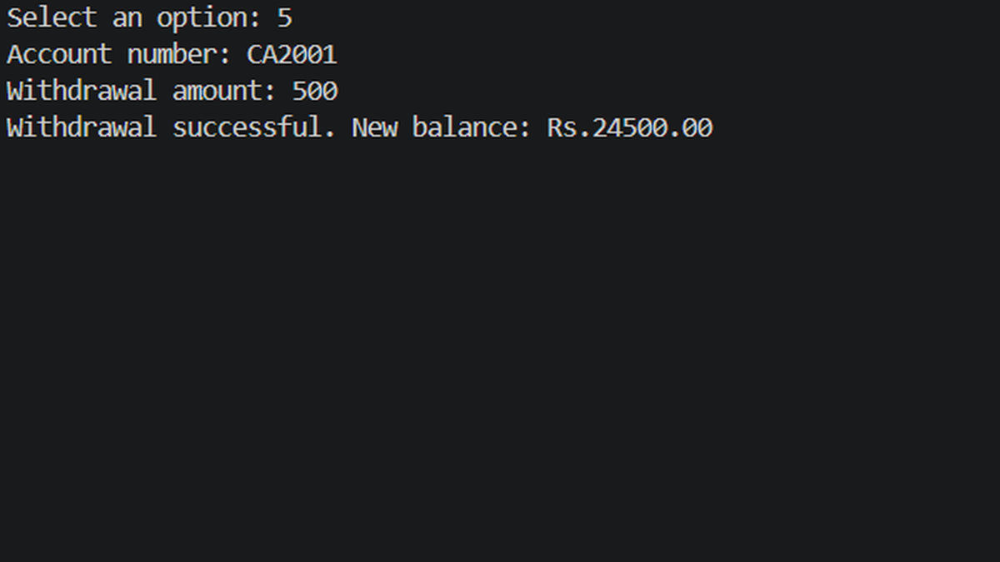
    </td>
  </tr>
  <tr>
    <td width="50%" valign="top">
      <h3>07 · Money Transfer</h3>
      <p>Transfers funds from a source account to a destination account.</p>
      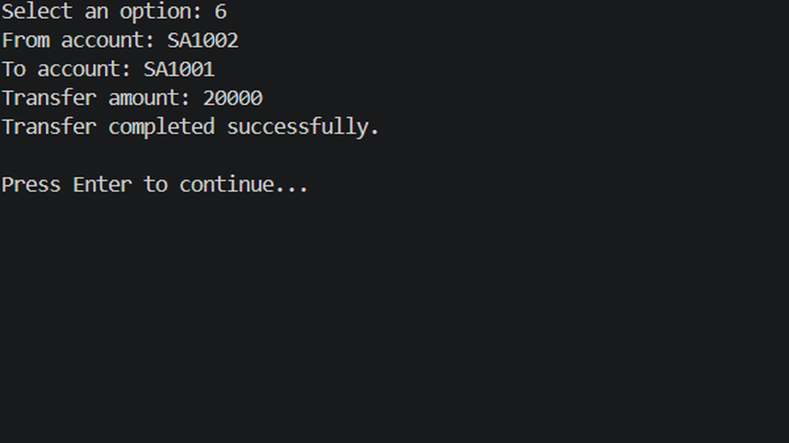
    </td>
    <td width="50%" valign="top">
      <h3>08 · Transaction History</h3>
      <p>Shows transaction IDs, transaction types, amounts, and recorded times.</p>
      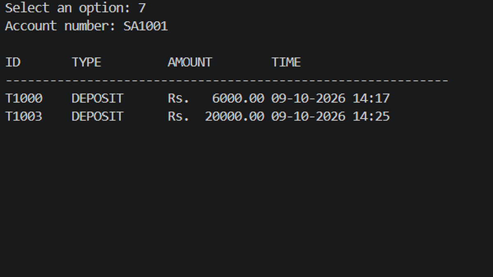
    </td>
  </tr>
  <tr>
    <td width="50%" valign="top">
      <h3>09 · Savings Interest</h3>
      <p>Displays the estimated interest for a savings account.</p>
      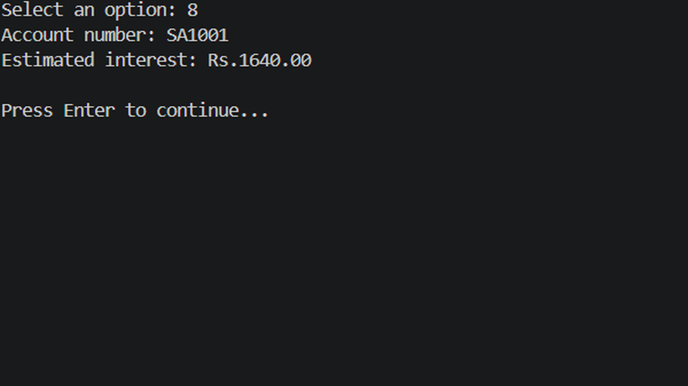
    </td>
    <td width="50%" valign="top">
      <h3>10 · Current Account Service Charge</h3>
      <p>Displays the applicable service charge for a current account.</p>
      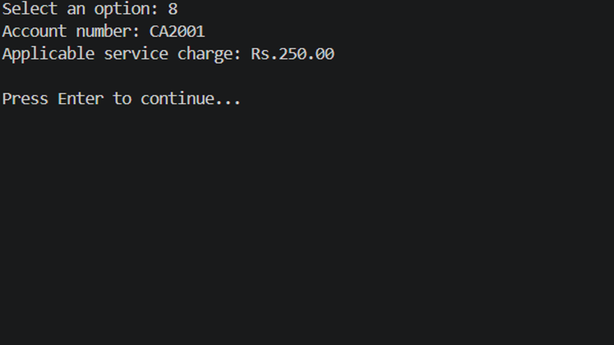
    </td>
  </tr>
  <tr>
    <td width="50%" valign="top">
      <h3>11 · System Statistics</h3>
      <p>Summarizes customer and account counts, total balance, and the payable example.</p>
      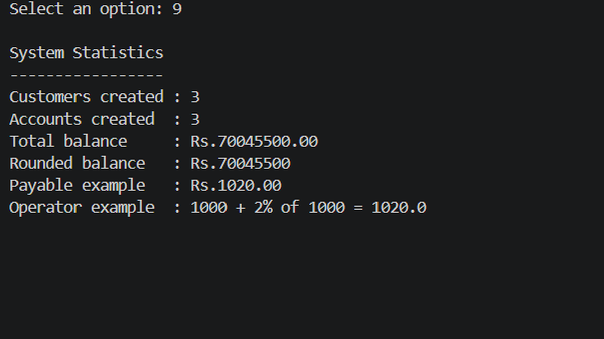
    </td>
    <td width="50%" valign="top">
      <h3>12 · Exit</h3>
      <p>Displays the closing message when the user exits the application.</p>
      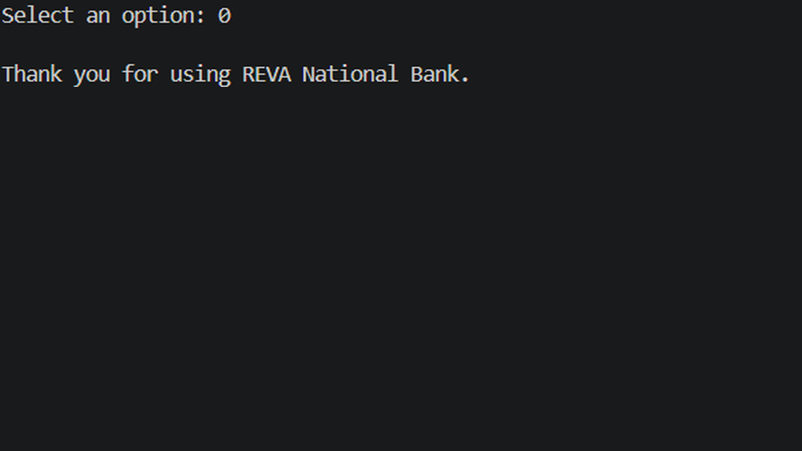
    </td>
  </tr>
</table>

## Data Flow Diagram

The diagram summarizes how customer actions connect to account operations, transaction records, balance and charge processing, and administrator statistics.

<p align="center">
  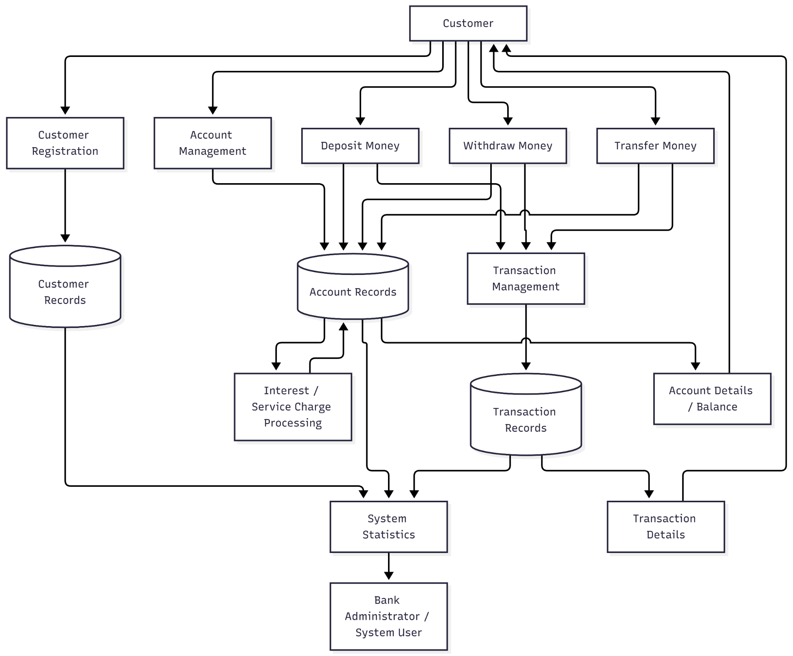
</p>

The diagram was prepared with assistance from **Mermaid AI** and exported as a PNG for clear display. An editable Mermaid representation is included at [`docs/data-flow-diagram.mmd`](docs/data-flow-diagram.mmd). The diagram documents the intended flow; the Java source code remains the implementation reference.

## UML Class Structure

The main inheritance and interface relationships are summarized below. GitHub renders this Mermaid diagram directly in the README.

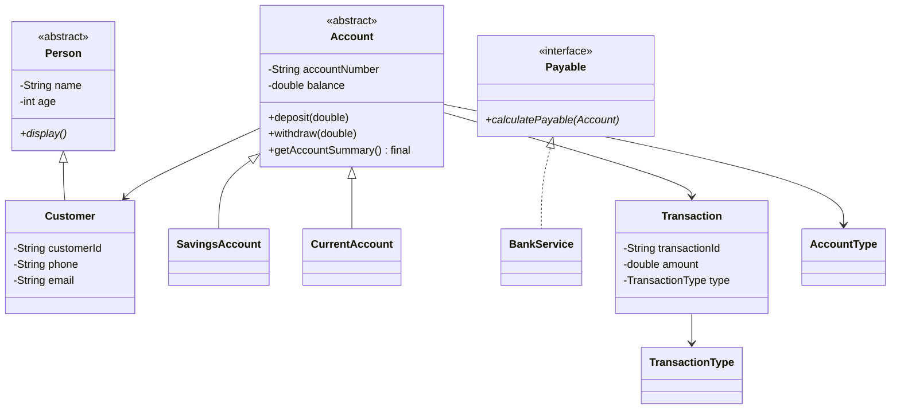

## Project Structure

```text
R24SA003_Aman_Chaturvedi_JavaProject/
├── README.md
├── .gitignore
├── data-flow-diagram.png
├── screenshots/
│   ├── 01-main-menu.png
│   ├── 02-customer-registration.png
│   ├── 03-account-opening.png
│   ├── 04-account-list.png
│   ├── 05-deposit-money.png
│   ├── 06-withdraw-money.png
│   ├── 07-transfer-money.png
│   ├── 08-transaction-history.png
│   ├── 09-savings-interest.png
│   ├── 10-current-account-service-charge.png
│   ├── 11-system-statistics.png
│   └── 12-exit.png
├── src/
│   └── com/reva/bank/
│       ├── app/Main.java
│       ├── model/
│       │   ├── Account.java
│       │   ├── AccountType.java
│       │   ├── CurrentAccount.java
│       │   ├── Customer.java
│       │   ├── Person.java
│       │   ├── SavingsAccount.java
│       │   ├── Transaction.java
│       │   ├── TransactionId.java
│       │   └── TransactionType.java
│       ├── service/
│       │   ├── BankService.java
│       │   └── Payable.java
│       └── util/InputUtil.java
└── docs/
    ├── data-flow-diagram.mmd
    └── sample_output.txt
```

## Object-Oriented Programming Concepts Demonstrated

| Concept / Requirement | Project implementation |
|---|---|
| Encapsulation | Private fields with public accessors in model classes. |
| Data types and variable scope | Primitive types, `String`, constants, and instance, static, and local variables. |
| Operators and precedence | Arithmetic operations in account and statistics calculations. |
| Type conversion | Explicit balance conversion for the rounded-balance example. |
| Enumerations | `AccountType` and `TransactionType`. |
| Control flow | Conditional statements, `switch`, loops, and jump statements. |
| Arrays of objects | `Account[]` through `getAccountArray()` in `BankService`. |
| Console I/O and formatting | `Scanner`, `System.out`, `printf`, and formatted strings. |
| Constructor overloading | Default and parameterized constructors in model classes. |
| Method overloading | `deposit(double)` and `deposit(int)` in `Account`. |
| Static members | Customer/account counters and transaction ID counter. |
| `this` and `super` | Constructor assignments, chaining, and parent-class access. |
| Inheritance and polymorphism | `Person` → `Customer`; `Account` → `SavingsAccount` and `CurrentAccount`. |
| Method overriding and dynamic binding | Account-specific methods are overridden and called through base-class references. |
| Abstract classes and methods | Abstract `Person` and `Account` classes. |
| Interface | `BankService` implements `Payable`. |
| Object method overriding | Implementations of methods such as `toString()` and `equals()`. |
| `final` | Final account-summary method and final `TransactionId` utility class. |
| Custom packages | `com.reva.bank.app`, `model`, `service`, and `util`. |

### Important Source Files

- **Application entry point:** [`Main.java`](src/com/reva/bank/app/Main.java)
- **Account abstraction:** [`Account.java`](src/com/reva/bank/model/Account.java)
- **Savings account:** [`SavingsAccount.java`](src/com/reva/bank/model/SavingsAccount.java)
- **Current account:** [`CurrentAccount.java`](src/com/reva/bank/model/CurrentAccount.java)
- **Customer model:** [`Customer.java`](src/com/reva/bank/model/Customer.java)
- **Bank service logic:** [`BankService.java`](src/com/reva/bank/service/BankService.java)
- **Payment interface:** [`Payable.java`](src/com/reva/bank/service/Payable.java)
- **Input utility:** [`InputUtil.java`](src/com/reva/bank/util/InputUtil.java)

## Compile and Run

Install a JDK (Java 11 or later) and run the following commands from the project root.

### Windows PowerShell

```powershell
New-Item -ItemType Directory -Force bin | Out-Null
$files = Get-ChildItem -Path src -Recurse -Filter *.java | ForEach-Object { $_.FullName }
javac -d bin $files
java -cp bin com.reva.bank.app.Main
```

### macOS / Linux / Git Bash

```bash
mkdir -p bin
javac -d bin $(find src -name "*.java")
java -cp bin com.reva.bank.app.Main
```

A sample console run is available in [`docs/sample_output.txt`](docs/sample_output.txt).

## Future Enhancement: AI-Assisted Transaction Insights

The current application is a conventional Java console application and **does not yet contain an AI model**. A genuine extension could flag unusual transaction patterns or generate transaction summaries. Such a feature should be implemented and tested separately before describing the project as AI-powered; a hard-coded rule alone should not be presented as machine learning.

## Submission Checklist

- [x] Java source organized into custom packages
- [x] Customer and account management operations
- [x] Deposit, withdrawal, transfer, and transaction history
- [x] Interest/service-charge processing and system statistics
- [x] OOP concepts and requirement mapping documented
- [x] Output screenshots included and referenced in this README
- [x] Data Flow Diagram and editable Mermaid representation included
- [x] Compilation and execution instructions included
- [x] Sample console output included

---

<p align="center">
  <sub>Java Programming Mini Project · REVA University · R24SA003</sub>
</p>
